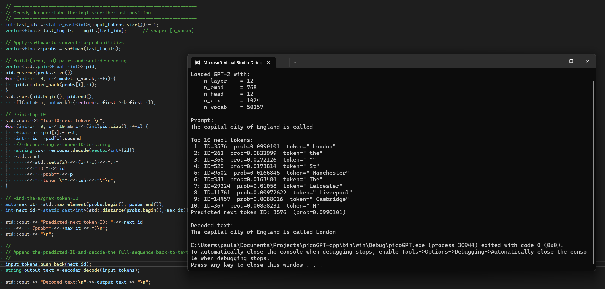

# picoGPT-cpp

A C++ implementation of GPT-2 (picoGPT-style) inference using only the C++ standard library. No external ML frameworks or third‑party libraries are required beyond a header‑only JSON parser for metadata and, optionally, a BPE tokenizer.

Based on [picoGPT](https://github.com/jaymody/picoGPT).

Accompanying blog post for picoGPT: [GPT in 60 Lines of Numpy](https://jaykmody.com/blog/gpt-from-scratch/)

## Overview

This implementation provides all core components of the GPT-2 model in a self‑contained manner:

* **Activation Functions**: Gaussian Error Linear Unit (GELU) and numerically stable softmax.
* **Normalization**: Layer Normalization with epsilon for stability.
* **Linear Layers**: Matrix multiplication plus bias for projections and feed‑forward networks.
* **Attention Mechanism**: Scaled dot‑product with causal masking to prevent attending to future tokens.
* **Multi-Head Self-Attention**: Learnable projections to queries, keys, and values; splitting into multiple heads; independent attention per head; and a final output projection.
* **Transformer Block**: Two sub‑layers (self‑attention and position‑wise feed‑forward) each preceded by layer normalization (pre‑norm) and followed by a residual connection.
* **GPT-2 Forward Pass**: Token and positional embeddings, stacked transformer blocks, final layer normalization, and a projection to vocabulary logits using weight tying.

## Components Detail

### Gaussian Error Linear Unit (GELU)

GELU is implemented using the tanh‑based approximation:

> GELU(x) = 0.5 \* x \* (1 + tanh(√(2/π) \* (x + 0.044715 \* x³)))

This smooth activation function helps with model convergence and performance.

### Softmax

To convert raw model scores into probabilities, softmax is computed in a numerically stable way by subtracting the maximum score in each vector before exponentiation and normalizing by the sum of exponentials.

### Layer Normalization

Each feature vector is normalized to zero mean and unit variance over its last dimension, then scaled and shifted by learned parameters (gamma and beta). An epsilon term ensures numerical stability when computing the inverse standard deviation.

### Linear Projection

All linear layers perform a standard matrix multiplication followed by adding a bias vector. These are used for token/key/value projections, feed‑forward expansions/contractions, and the final output projection.

### Scaled Dot-Product Attention

Given query (Q), key (K), and value (V) matrices, attention scores are computed as:

> scores = (Q · Kᵀ) / √dₖ + mask

A causal mask adds a large negative constant to future positions. Softmax is applied row‑wise to obtain attention weights, which are then multiplied by V to produce the attended output.

### Multi-Head Self-Attention (MHA)

1. **QKV Projection**: A single linear layer maps the input to concatenated queries, keys, and values.
2. **Splitting**: The combined QKV tensor is split into separate Q, K, V matrices, then further divided into *n* heads of smaller dimension.
3. **Per-Head Attention**: Each head independently applies scaled dot‑product attention with the same causal mask.
4. **Concatenation**: Head outputs are concatenated along the embedding dimension.
5. **Output Projection**: A final linear layer projects the concatenated heads back to the model’s hidden size.

### Transformer Block

Each block follows the “pre‑norm” design:

1. **LayerNorm → Multi-Head Attention → Residual**
2. **LayerNorm → Feed-Forward Network → Residual**

The feed‑forward sub‑layer consists of a linear expansion (4× hidden size), GELU activation, and linear contraction back to the hidden size.

### GPT-2 Forward Pass

1. **Embedding**: Sum token embeddings and positional embeddings.
2. **Transformer Stack**: Apply each transformer block sequentially.
3. **Final LayerNorm**: Normalize the final hidden states.
4. **Vocabulary Projection**: Compute logits by dotting with the transposed token embedding matrix (weight tying).

## Numerical Stability

* Softmax uses max‑subtraction to avoid overflow.
* Layer normalization adds an epsilon before inverting the standard deviation.
* Attention scaling by √dₖ prevents excessively large dot‑product magnitudes.

## Requirements

* **C++17** compiler (e.g., `g++ -std=c++17 -O2`).
* **nlohmann/json.hpp** (header‑only JSON library) for loading model metadata.

## Usage Outline

1. **Load model metadata** (dimensions, number of layers, hidden size, etc.) and raw weight binaries (`.bin` files).
2. **Tokenize** input text into a sequence of token IDs (using BPE).
3. **Run** the forward pass to obtain a \[sequence × vocabulary] logits matrix.
4. **Decode** by selecting next token(s) (e.g., greedy or sampling) and converting IDs back to text.
